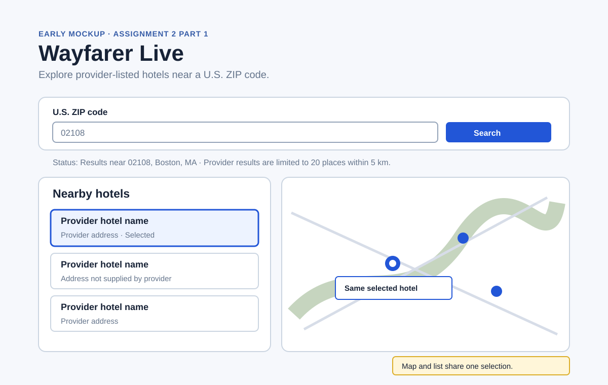

# Assignment 2 — Part 1 research notes

Research date: September 29, 2026.

## Sources and observations

- [Google hotel search help](https://support.google.com/travel/answer/6276008?hl=en) describes hotel results as a short list paired with a map. That supports putting the text list and map on screen together rather than hiding one behind a separate mode. Its brief description does not explain a keyboard-accessible shared selection, so Wayfarer Lite makes the selection state explicit in both views.
- [Geoapify Geocoding API](https://apidocs.geoapify.com/docs/geocoding/) supports location filtering. The application will accept only five-digit U.S. ZIP codes and confirm the returned U.S. postcode equals the requested ZIP before making a nearby search.
- [Geoapify Places API](https://apidocs.geoapify.com/docs/places/) documents `accommodation.hotel`, circle filters in metres, and result limits. The application will request up to 20 hotel-category places within a 5 km circle around the resolved postcode point. The screen will say the list is a limited provider response, not an exhaustive hotel inventory.
- [Leaflet Quick Start](https://leafletjs.com/examples/quick-start/) documents markers, map controls, and visible tile attribution. It provides map mechanics rather than hotel-result semantics, so the application adds a labeled center marker, native list buttons, and one selected state for both a marker and list item.

## Decisions and tradeoffs

- The search button is disabled only while a request is active. Inline status text distinguishes invalid ZIP input, an unresolved ZIP, no nearby provider results, and service failures; a service failure is never shown as an empty result.
- A hotel card is a keyboard-accessible button. Selecting it highlights the matching marker and opens its popup; selecting a marker highlights and focuses the matching card. This keeps list and map selections synchronized.
- The API response supplies hotel names, addresses, and coordinates. The interface does not invent nightly prices, availability, ratings, or booking claims. Missing names and addresses receive clear "Not supplied by provider" labels.
- The application deliberately does not make an exhaustive-inventory claim: coverage and fields can vary by provider, and the request is capped at 20 results.

## Early mockup

The initial design has one ZIP search control, a status line below it, a selectable hotel list on the left, and an equal-height map on the right. During development the wording may change, but the required distinct states and the one shared selection remain fixed.
