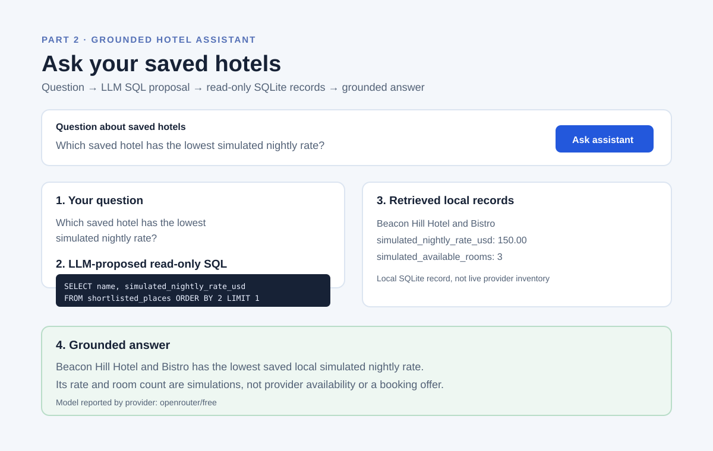

# Assignment 2 Part 2 — RAG research and early mockup

Research date: October 6, 2026.

## Sources and decisions

- [OpenRouter Quickstart](https://openrouter.ai/docs/quickstart) documents its standard chat-completions HTTP endpoint and backend bearer-token authentication. Wayfarer Lite uses Python's standard-library HTTP client, so no LLM SDK or browser credential is needed.
- [OpenRouter's free model collection](https://openrouter.ai/collections/free-models) shows that free-model availability changes. The default is the `openrouter/free` router, while `OPENROUTER_MODEL` allows a verified available model to be selected locally before recording.
- [Python sqlite3 authorization](https://docs.python.org/3/library/sqlite3.html#sqlite3.Connection.set_authorizer) provides an engine-level authorization callback. Wayfarer Lite applies it in addition to string validation so the model's SQL may read only `shortlisted_places`.

## Decisions and tradeoffs

- The system uses two model calls: planning produces a visible JSON SQL proposal, then answer generation receives the traveler question plus retrieved SQLite records. This makes the required evidence visible in the UI and prevents the answer from relying on an unshown database result.
- There is no vector database. The saved shortlist is intentionally small, and SQLite is the required local retrieval store.
- The planner may request only one direct `SELECT` from `shortlisted_places`, capped at 20 rows. The backend—not the LLM or browser—makes the decision to execute it.
- Simulated rates and availability are local stored values. Prompts and UI explicitly identify them as simulations, never provider inventory or a booking offer.

## Early mockup

The mockup places a question box below the saved shortlist and displays all four reviewable stages: traveler question, proposed SQL, retrieved records, and grounded answer.
