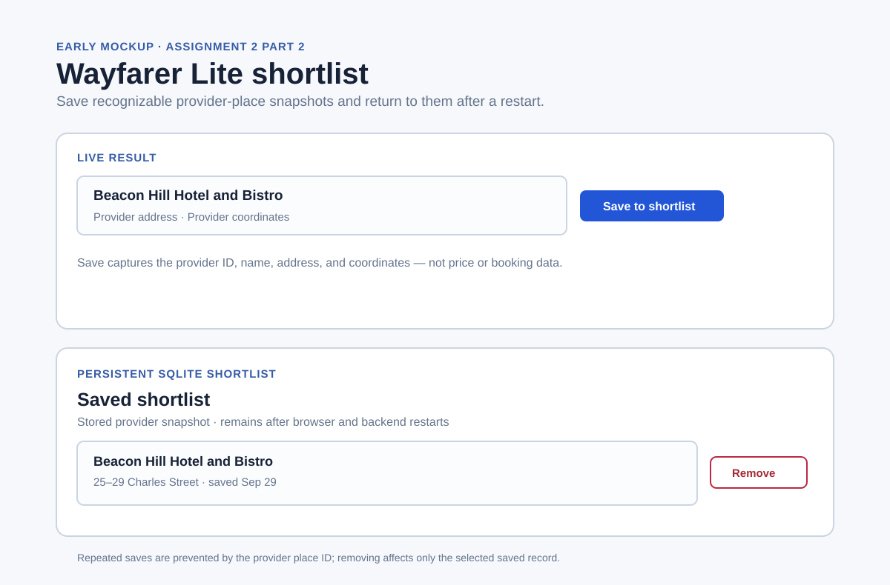

# Assignment 2 — Part 2 research notes

Research date: September 29, 2026.

## Sources and observations

- [Google Maps saved places help](https://support.google.com/maps/answer/3184808?hl=en-GB) presents saving as a direct action on a place, then provides a separate saved-list view with an individual remove action. Wayfarer Lite adopts one clear **Save to shortlist** action on each returned place and a persistent **Saved shortlist** section with one **Remove** action per saved place.
- [Google Maps lists help](https://support.google.com/maps/answer/7280933?hl=en-AU) shows that a saved place remains a recognizable list item rather than a temporary search filter. Wayfarer Lite stores the provider ID plus a snapshot of its name, address, and coordinates, so the saved record stays understandable when a later provider response changes or is unavailable.
- [SQLite conflict handling](https://www.sqlite.org/lang_conflict.html) documents `INSERT OR IGNORE` for a uniqueness conflict. The shortlist uses Geoapify's provider place ID as its primary key and `INSERT OR IGNORE` so a repeated save produces one saved record without overwriting its original snapshot.

## Decisions and tradeoffs

- The original shortlist stores provider place ID, name, address, latitude, longitude, and saved timestamp. The subsequent local-simulation extension adds a backend-generated simulated nightly rate and available-room count; both are visibly labeled as local simulations and are not Geoapify data. It still has no booking field.
- The frontend may label a returned place as already saved, but FastAPI and SQLite are the duplicate-prevention authority. A direct repeated POST must still leave one row.
- Save and removal use normal keyboard-focusable buttons. Removal asks for confirmation because it is destructive; the saved list updates only after the backend confirms deletion.
- `backend/data/assignment2-shortlist-sample.json` is a labeled fixed verification fixture. It is used for repeatable persistence checks, not presented as a live Geoapify result.
- The Part 1 live-search controller already has simulated provider-failure coverage. Part 2 adds fixed-fixture tests for duplicate save, removal, and SQLite persistence after controller reinitialization.

## Early mockup

The mockup adds a save control beside each live result and a separate shortlist below the map. The final interface may adjust spacing, but keeps those controls and clearly labels the stored data as a saved provider snapshot.
