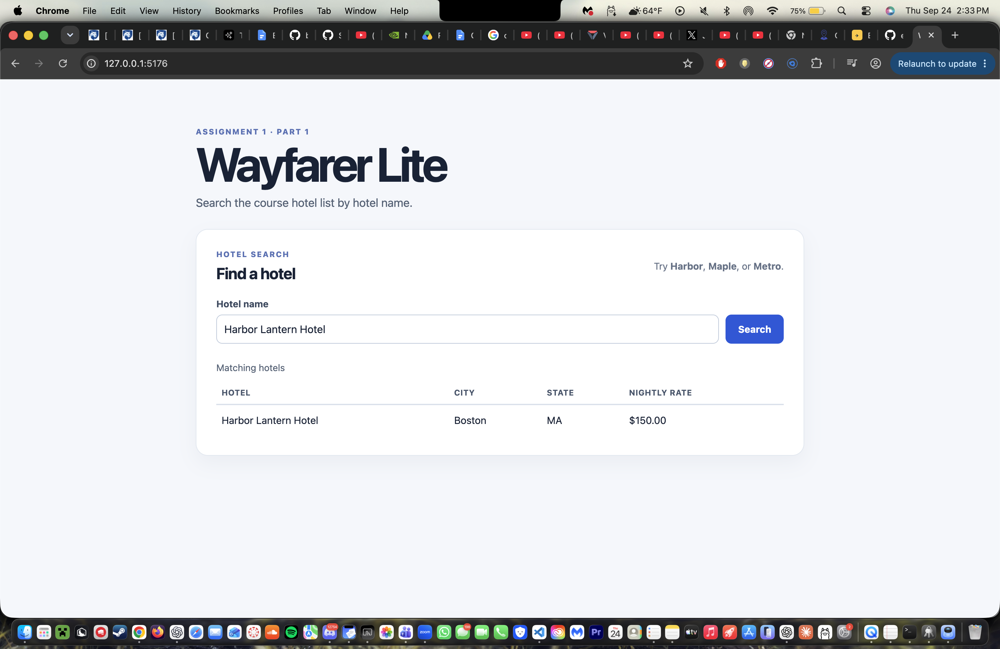
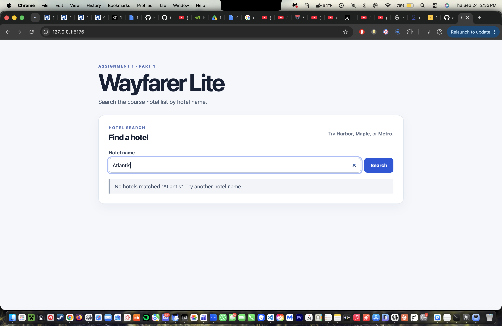

# Wayfarer Lite — Part 1

## Repository and commit

Repository URL: [https://github.com/bkaping/expedia-lite](https://github.com/bkaping/expedia-lite)
Submitted Part 1 implementation commit: [82d43ec](https://github.com/bkaping/expedia-lite/commit/82d43ec)

## Implementation

Wayfarer Lite provides a hotel-name search flow. The Vue frontend collects the hotel name and presents matching hotels in a labeled table. FastAPI validates and forwards the request to a Python CSV search controller. The controller reads the supplied `hotels.csv` data and returns case-insensitive matching hotel records.

## Verification

| Action | Expected result | Observed result |
| --- | --- | --- |
| Search `Harbor` | Harbor Lantern Hotel appears with its city, state, and nightly rate. | Observed in the local browser: Harbor Lantern Hotel, Boston, MA, and $150.00 appeared in the labeled results table. |
| Search a nonmatching name | A clear no-results message appears. | Observed in the local browser: `No hotels matched “Atlantis”. Try another hotel name.` |

Screenshots from the manual browser checks:

## Project context and next steps

- [README](README.md)
- [Project guidance](AGENTS.md)
- [Design note](docs/design.md)
- [Selected prompts](prompts/selected-prompts.md)
- [Current handoff](handoffs/current.md)

The supplied course CSV data are installed. Run the two browser checks, add accessible repository-hosted screenshots, replace the Part 1 commit placeholder, and submit this file as `report.md`.
